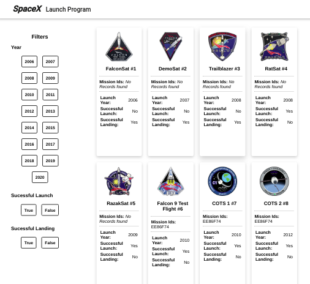
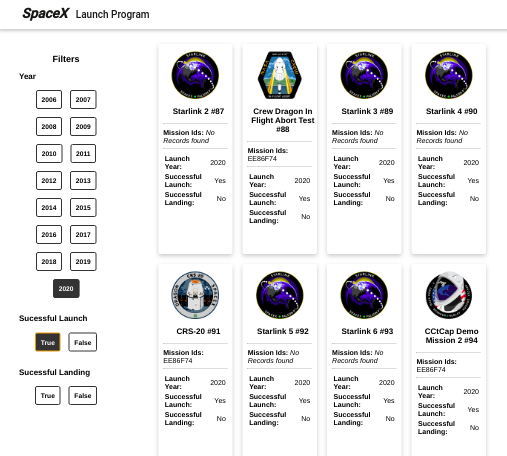
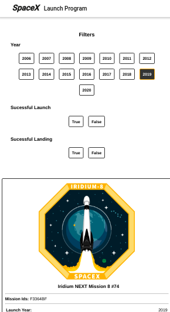
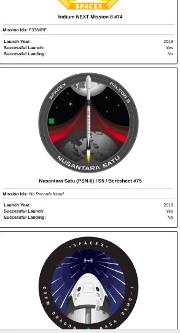
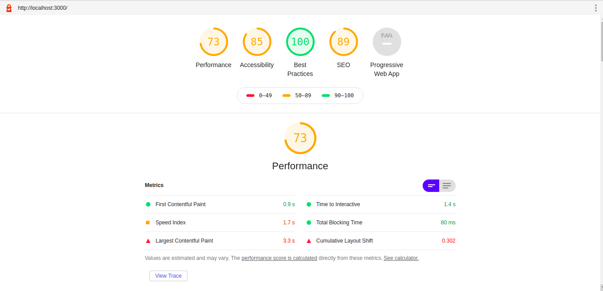
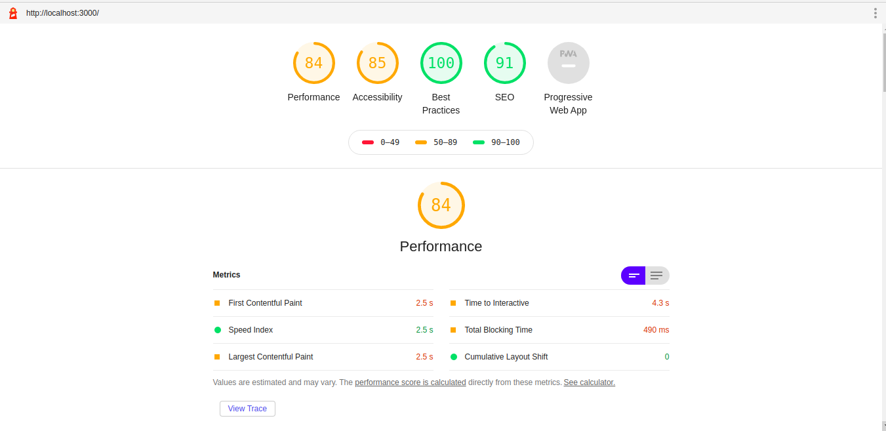

# SpaceX Launch Program

A front-end application which would help users list and browse all launches by SpaceX program.

## Table of content
- Getting Started
    - Prerequisites
    - Setup
- Live Demo
- Image
- Performance
- Authors

## Getting Started

**React** run in the core of this application but the problem with using React is its used for client side rendering. React can also be run in the server side and that is the best feature of React. To acheive server side rendering I am using [**Next.js**](https://nextjs.org/) framework.

The working of this application is very simple, The landing page is rendered in the server and the reset of the view is handled in client side, i.e. the browser.

There are 2 main folders, pages and components, and the program starts at index.js which is present in the pages folder.

### Prerequisites

[Node](https://nodejs.org/en/) (version 10.13 and above)

### Setup

To set up this application open your terminal and run the following command.
```
npm install && npm run build
npm start

```
The above command will install all the necessary packages and also build the appliation.

## Live Demo
https://spacex-launch-program.vercel.app/

## Images





## Performance




## Authors

- Daryl Aranha - Initial work - [darylaranha](https://github.com/DarylAranha)
